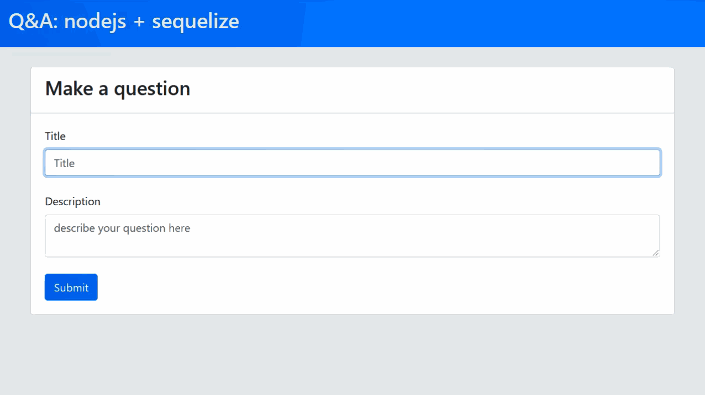

# Q&A-platform
This project is a simple Q&A platform, i made it to memorize some technologies i've learned in courses, and also start working with database integration(mySQL) with express.js using Sequelize 

## Technologies
This project was made using:
* Node.js
* Express.js
* Sequelize
* mySQL
* Ejs
* Javascript
* Bootstrap

## screenshots
The main focus of this project was not the design, but the backend,however I put a gif to show how it works.

## LICENSE
[MIT LICENSE](LICENSE)

